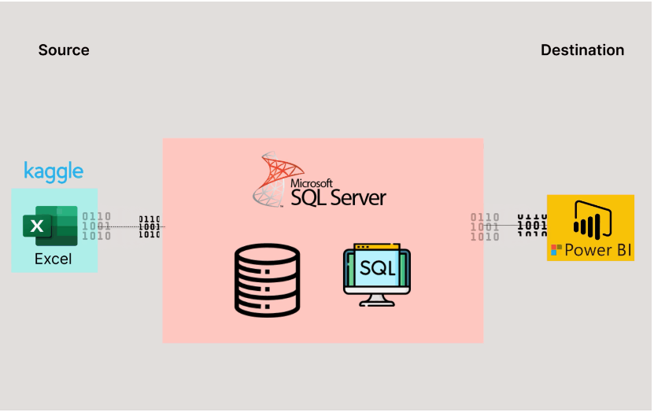

# Amazon Sales Data Portfolio

***Hey there!*** 

- I'm excited to share with you this comprehensive analysis of Amazon sales data, transitioning from Excel to Power BI. This project aims to provide valuable insights into various aspects of sales performance within Amazon by leveraging the powerful visualization and analytical capabilities of Power BI.

## Problem Statement

- As Amazon continues to grow, managing and analyzing vast amounts of sales data has become increasingly challenging. The traditional method of using Excel for data analysis has proven to be insufficient for handling large datasets and generating actionable insights efficiently. Key area such as regional sales performance, item-wise sales, profit analysis and annual sales trends require a more robust and dynamic tool to uncover deeper insights and facilitate data-driven decision-making.

## Ideal Solution 

- To address these challenges, transitioning from Excel to Power BI offers an ideal solution. Power BI's advanced data processing capabilities, interactive visualizations and user-friendly interface enable comprehensive analysis and real-time reporting.

- With Power BI, we can:

***1. Visualize Regional Sales and Profits:***

- Identify which region generated the most sales and profits, categorized by sales channel (offline and online).

***2. Analyze Item Type Performance:***

- Determine which item type generated the most sales and profits, categorized by sales channel (offline and online).

***3.Summarize Key Metrics:***

- Display the total sales value and total profit value in the dataset through clear and concise visuals.

***4. Examine Annual Sales Trends:***

- Track and analyze sales trends over the years to understand growth patterns and seasonal variations.

***5. Detailed Item Type Analysis by Region and Year:****

- Identify the item type that generated the most sales in each region, categorized by sales channel (offline and online) for each year.

