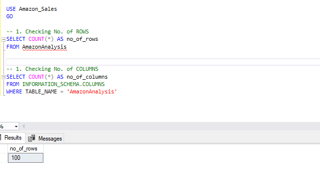

# Amazon Sales Data Portfolio

***Hey there!*** 

- I'm excited to share with you this comprehensive analysis of Amazon sales data, transitioning from Excel to Power BI. This project aims to provide valuable insights into various aspects of sales performance within Amazon by leveraging the powerful visualization and analytical capabilities of Power BI.

## Problem Statement

- As Amazon continues to grow, managing and analyzing vast amounts of sales data has become increasingly challenging. The traditional method of using Excel for data analysis has proven to be insufficient for handling large datasets and generating actionable insights efficiently. Key area such as regional sales performance, item-wise sales, profit analysis and annual sales trends require a more robust and dynamic tool to uncover deeper insights and facilitate data-driven decision-making.

## Ideal Solution 

- To address these challenges, transitioning from Excel to Power BI offers an ideal solution. Power BI's advanced data processing capabilities, interactive visualizations and user-friendly interface enable comprehensive analysis and real-time reporting. Additionally, SQL was utilized for data manipulation and extraction, ensuring a more structured and efficient data handling process. 

- With Power BI, we can:

***1. Visualize Regional Sales and Profits:***

- Identify which region generated the most sales and profits, categorized by sales channel (offline and online).

***2. Analyze Item Type Performance:***

- Determine which item type generated the most sales and profits, categorized by sales channel (offline and online).

***3. Summarize Key Metrics:***

- Display the total sales value and total profit value in the dataset through clear and concise visuals.

***4. Examine Annual Sales Trends:***

- Track and analyze sales trends over the years to understand growth patterns and seasonal variations.

***5. Detailed Item Type Analysis by Region and Year:****

- Identify the item type that generated the most sales in each region, categorized by sales channel (offline and online) for each year.

By leveraging Power BI's capabilities and SQL for data processing, we can transform Amazon's sales data into a powerful tool for strategic planning and performance improvement. This project showcases the transition process and the resulting insights that drive better business decisions.

## Data Source

- Our database is available at this [this link](https://github.com/Ryanmugo/Amazon_Sales/tree/main/Assets/Docs).

## Stages of the Amazon Sales Data Analysis Project

- Transitioning from Excel to SQL to PowerBI involves several key stages, each critical to achieving a comprehensive and insightful analysis. Here's a breakdown of the stages:

   ### 1. Design

   - ***Objective Setting***: Clearly define the goals of the analysis. For example, understanding regional sales performance, item-wise sales and annual sales trends.
     
   - ***Data Requirements:*** Identify the necessary data fields and structure needed for the analysis. This includes specifying columns like 'Region', 'Sales Channel', 'Item Type', 'Sales', 'Profit' and 'Year'.

   - ***Database Schema Design:***  Plan how the data will be stored and organized in SQL. Create an entity-relationship diagram (ERD) if needed.

   ## 2. Development

   - ***Data Extraction and Transformation:*** Extract data from Excel and transform it into a suitable format for SQL. This may involve cleaning the data, handling missing values and normalizing data fields.
     
   - ***SQL Database Setup:*** Create tables and relationships in SQL to store the cleaned data. Load the transformed data int these tables.

   - ***SQL Queries:*** Write SQL queries to aggregate and prepare the data for analysis in Power BI. This includes queries to calculate total sales, profits and other key metrics.
 
   - ***Data Integration:*** Connect Power BI to the SQL database to pull the required data for visualization.
 
   ## 3. Testing

    - ***Data Validation:*** Ensure that the data loaded into SQL is accurate and consistent with the original Excel data. Validate SQL queries to ensure they return the expected results.
 
    - ***Performance Testing:*** Test the performance of SQL queries and Power BI reports to ensure they run efficiently, especially with large datasets.
 
    - ***User Acceptance Testing (UAT):*** Share preliminary reports with stakeholders to gather feedback and make necessary adjustments.
 
   ## 4. Analysis

    - ***Creating Visualizations in Power BI:*** Develop various visualizations to answer the key questions.
 
    - ***Interactive Dashboards:*** Combine the visualizations into a single, interactive Power BI dashboard. Enable drill-down features and slicers for dynamic data exploration.
 
    - ***Insights and Reporting:*** Analyze the visualizations to derive insights and prepare a comprehensive report highlighting key findings and recommendations for strategic planning.
  
## SQL Code and Results

### SQL Code for Creating the Database and View

## Power BI Dashboard Showcase 

- After transitioning the data from Excel to SQL and then to Power BI, we've created a comprehensive and interactive dashboard to visualize and analyze Amazon sales data. Below is an image layout of the Power BI dashboard, which includes slicers for region, sales channel(offline and online) and year:

## Conclusion

- By leveraging SQL for data processing and Power BI for visualization, this project demonstrates how to effectively analyze Amazon sales data. The insights gained from this analysis can drive strategic decisions, improve sales performance and enhance overall business efficiency.

- You can download the Power BI dashboard and the supporting documents from the [Amazon Sales Data Portfolio](https://github.com/Ryanmugo/Amazon_Sales/tree/main/Assets/Docs/Amazon_Sales_Data.pbix).
